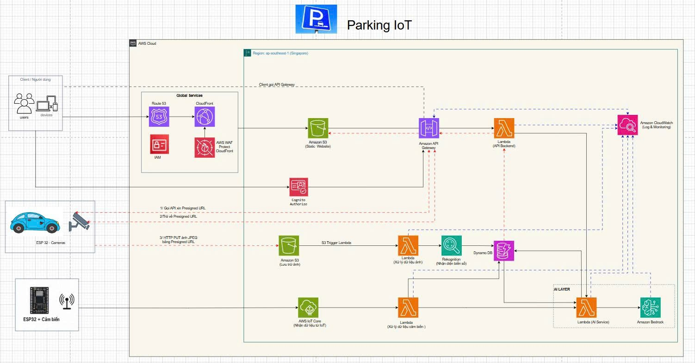

# PROJECT PROPOSAL: Smart Parking IoT System

**AWS Serverless Solution for Parking Monitoring, License Plate Recognition, and AI Assistance**

## 1. Executive Summary

This project proposes the development of a **Smart Parking IoT System** that automates parking lot monitoring, vehicle identification, and real-time data management. The system uses IoT devices such as **ESP32 Camera** and **ESP32 sensors** to collect vehicle images, parking slot status, and operational data from the parking area.

The collected data is sent to AWS services such as **AWS IoT Core**, **Amazon S3**, **Amazon API Gateway**, and processed using **AWS Lambda**. Vehicle images are stored in Amazon S3 and automatically trigger Lambda functions for image processing. **Amazon Rekognition** is used to analyze vehicle images and support license plate recognition. The processed results and sensor data are stored in **Amazon DynamoDB** for management, searching, and dashboard visualization.

In addition, the system integrates **Amazon Bedrock** through a **Lambda AI Service** to support intelligent data analysis and natural language queries. By using an AWS Serverless architecture, the system can scale flexibly, reduce operational costs, and avoid traditional server management.

---

## 2. Problem Statement

### 2.1 Current Challenges

Traditional parking lots often face several limitations in daily operation and management. Vehicle entry and exit records are usually handled manually, which may lead to mistakes in license plate recording, parking time tracking, and parking slot monitoring. As the number of vehicles increases, manual management becomes more difficult, less accurate, and time-consuming.

The main challenges include:

* Difficulty in checking real-time parking slot availability.
* Manual recording of vehicle entry and exit information.
* Lack of centralized storage for images, license plate data, and sensor data.
* Difficulty in tracking vehicle history and parking activities.
* Limited scalability when adding more cameras, sensors, or parking slots.
* High cost if the system requires physical servers or dedicated infrastructure.

### 2.2 Proposed Solution

The proposed solution is to build a **Smart Parking IoT System using AWS Serverless architecture**. The system uses ESP32 Camera to capture vehicle images and ESP32 sensors to detect parking slot status. The collected data is then sent to AWS for processing, storage, monitoring, and visualization.

The main features include:

* ESP32 Camera captures vehicle images when cars enter or exit the parking area.
* ESP32 sensors detect the status of each parking slot.
* Vehicle images are uploaded to Amazon S3 using Presigned URLs.
* AWS Lambda processes events when new images are uploaded to S3.
* Amazon Rekognition analyzes vehicle images and supports license plate recognition.
* DynamoDB stores vehicle information, license plate data, timestamps, parking slot status, and sensor data.
* Web/App interface allows users to log in, view parking status, and check vehicle history.
* Amazon Cognito provides user authentication and authorization.
* Amazon Bedrock supports AI-based data analysis and intelligent user queries.
* Amazon CloudWatch monitors logs, errors, and system performance.

### 2.3 Expected Benefits

The system helps reduce manual work, improve parking management accuracy, support real-time monitoring, and create a centralized data platform for future AI analysis. With serverless architecture, the system can scale based on the number of devices, vehicles, and user requests.

---

## 3. Solution Architecture

The system follows an **AWS Serverless Architecture** to reduce infrastructure management, improve scalability, and integrate easily with AWS IoT, AI, storage, and database services.



### 3.1 Key AWS Services

#### User Interface

* **Amazon Route 53:** Manages the domain name of the system.
* **Amazon CloudFront:** Delivers website content with low latency.
* **AWS WAF:** Protects the web application from malicious requests.
* **Amazon S3 Static Website:** Hosts the static Web/App interface.

#### Authentication and Authorization

* **Amazon Cognito:** Manages user login, authentication, and access control.
* **IAM:** Controls permissions between AWS services.

#### API and Backend Processing

* **Amazon API Gateway:** Receives requests from Web/App and IoT devices.
* **AWS Lambda API Backend:** Handles the main business logic of the system.
* **AWS Lambda Image Processing:** Processes images after they are uploaded to S3.
* **AWS Lambda Sensor Processing:** Processes sensor data from ESP32 devices.
* **AWS Lambda AI Service:** Connects with Amazon Bedrock for AI-based functions.

#### IoT and Edge Devices

* **ESP32 Camera:** Captures images of vehicles.
* **ESP32 Sensors:** Detect parking slot status.
* **AWS IoT Core:** Receives IoT data from devices using the MQTT protocol.

#### Storage and Database

* **Amazon S3:** Stores vehicle images.
* **Amazon DynamoDB:** Stores license plate data, vehicle history, parking slot status, and user-related data.

#### Image Processing and AI

* **Amazon Rekognition:** Analyzes vehicle images and supports license plate recognition.
* **Amazon Bedrock:** Provides AI support for intelligent analysis and natural language queries.

#### Monitoring

* **Amazon CloudWatch:** Collects logs, monitors system errors, and tracks service performance.

---

## 4. System Workflow

### 4.1 Web/App Access Flow

Users access the system through a web browser or mobile device. The website is hosted on Amazon S3 Static Website and distributed through Amazon CloudFront. Route 53 manages the domain name, while AWS WAF helps protect the application from harmful requests.

**Workflow:**

User → Route 53 → CloudFront → AWS WAF → Amazon S3 Static Website → API Gateway → Lambda Backend → DynamoDB

Explanation:

* The user accesses the system through a domain name.
* Route 53 routes the request to CloudFront.
* CloudFront delivers the web interface from Amazon S3.
* AWS WAF filters and blocks malicious requests.
* The Web/App calls API Gateway to retrieve parking data.
* Lambda Backend processes the request and queries DynamoDB.
* DynamoDB returns data to the Web/App for display.

---

### 4.2 User Authentication Flow

The system uses Amazon Cognito to authenticate users before allowing access to parking management features. After successful login, Cognito returns an authentication token. The Web/App sends this token with requests to API Gateway.

**Workflow:**

User → Amazon Cognito → API Gateway → Lambda Backend → DynamoDB

Explanation:

* The user enters username and password in the Web/App.
* Amazon Cognito verifies the login information.
* If authentication is successful, Cognito returns a token.
* The Web/App sends the token to API Gateway.
* API Gateway uses Cognito Authorizer to validate access.
* Lambda Backend handles the request if the user is authorized.

---

### 4.3 ESP32 Camera Image Upload Flow

When a vehicle enters or exits the parking lot, the ESP32 Camera captures an image. Instead of sending the image directly through Lambda, the device requests a **Presigned URL** from API Gateway. Then, the ESP32 Camera uploads the image directly to Amazon S3.

This approach reduces Lambda workload, improves upload efficiency, and follows AWS best practices.

**Workflow:**

ESP32 Camera → API Gateway → Lambda Backend → Presigned URL → Amazon S3 → S3 Trigger → Lambda Image Processing → Amazon Rekognition → DynamoDB

Detailed steps:

1. ESP32 Camera captures a vehicle image.
2. ESP32 Camera sends a request to API Gateway to get a Presigned URL.
3. API Gateway forwards the request to Lambda Backend.
4. Lambda Backend generates a Presigned URL for uploading the image to Amazon S3.
5. ESP32 Camera receives the Presigned URL.
6. ESP32 Camera uploads the JPEG image directly to Amazon S3.
7. Amazon S3 triggers an ObjectCreated event.
8. The event invokes Lambda Image Processing.
9. Lambda calls Amazon Rekognition to analyze the image.
10. The recognition result is stored in DynamoDB.

Example image data:

```json
{
  "image_id": "car_001.jpg",
  "plate_number": "51A-12345",
  "direction": "in",
  "timestamp": "2026-04-27T10:30:00",
  "s3_url": "s3://parking-image-bucket/car_001.jpg"
}
```

---

### 4.4 ESP32 Sensor Data Flow

ESP32 sensors are used to detect the status of each parking slot. The sensors may be ultrasonic sensors, infrared sensors, or magnetic sensors depending on the real implementation. The sensor data is sent to AWS IoT Core using the MQTT protocol.

**Workflow:**

ESP32 Sensor → AWS IoT Core → Lambda Sensor Processing → DynamoDB

Detailed steps:

1. ESP32 sensor reads the parking slot status.
2. The device sends sensor data to AWS IoT Core using MQTT.
3. AWS IoT Core receives the data from the device.
4. IoT Rule forwards the data to Lambda Sensor Processing.
5. Lambda validates and normalizes the data.
6. The processed data is stored in DynamoDB.
7. Web/App retrieves data from DynamoDB to display real-time parking status.

Example sensor data:

```json
{
  "slot_id": "A01",
  "status": "occupied",
  "timestamp": "2026-04-27T10:30:00"
}
```

Field description:

* `slot_id`: Parking slot ID.
* `status`: Parking slot status, such as `available` or `occupied`.
* `timestamp`: Time when the data is recorded.

---

### 4.5 AI Service Flow

The system integrates an AI layer to help users and administrators query parking data using natural language. The Web/App sends a question to API Gateway. Then, Lambda AI Service processes the request, retrieves data from DynamoDB if necessary, and calls Amazon Bedrock to generate a response.

**Workflow:**

Web/App → API Gateway → Lambda AI Service → Amazon Bedrock → DynamoDB → Web/App

Possible AI features include:

* Asking the number of available parking slots.
* Summarizing the number of vehicles currently in the parking lot.
* Analyzing peak parking hours.
* Suggesting available parking areas.
* Helping administrators search vehicle entry and exit history.
* Summarizing daily parking lot activity.

Example question:

> How many parking slots are currently available?

Example response:

> There are currently 12 available parking slots: 5 in Area A and 7 in Area B.

---

### 4.6 Monitoring Flow

Amazon CloudWatch is used to collect logs and monitor the operation of the system. It can receive logs from Lambda, API Gateway, AWS IoT Core, and other related components.

**Monitoring Flow:**

API Gateway / Lambda / IoT Core / Rekognition / DynamoDB → CloudWatch

CloudWatch helps to:

* Track Lambda execution errors.
* Monitor API Gateway requests.
* Check IoT device data flow.
* Record image processing logs.
* Detect system issues during operation.

---

## 5. Technical Implementation Plan

### 5.1 Phase 1: System Analysis and Design

In the first phase, the team analyzes system requirements and defines the implementation scope.

Main tasks:

* Identify the number of entry and exit gates that need ESP32 Cameras.
* Identify the number of parking slots that need sensors.
* Design the AWS architecture diagram.
* Design the data flow between IoT devices and AWS.
* Design DynamoDB table structure.
* Define user roles such as User, Manager, and Admin.

### 5.2 Phase 2: IoT Device Deployment

This phase focuses on configuring and testing ESP32 devices.

Main tasks:

* Configure ESP32 Camera to capture vehicle images.
* Configure ESP32 sensors to read parking slot status.
* Connect ESP32 sensors to AWS IoT Core using MQTT.
* Test sensor data transmission to AWS IoT Core.
* Test ESP32 Camera requesting Presigned URL and uploading images to S3.
* Check image quality under different lighting conditions.

### 5.3 Phase 3: AWS Backend Development

The backend is developed using AWS serverless services.

Main tasks:

* Create Amazon API Gateway to receive requests from Web/App and devices.
* Create Lambda Backend for business logic.
* Create the Presigned URL generation function.
* Create Amazon S3 Bucket for vehicle image storage.
* Configure S3 ObjectCreated event to trigger Lambda Image Processing.
* Integrate Amazon Rekognition for image analysis.
* Create DynamoDB tables for parking data.
* Create Lambda Sensor Processing for data from AWS IoT Core.
* Configure IAM roles with proper permissions.

### 5.4 Phase 4: Web/App Development

The Web/App interface allows users and administrators to monitor and manage the parking lot.

Main features:

* User login and authentication.
* Parking lot map display.
* Real-time parking slot status display.
* Vehicle entry and exit history.
* License plate, image, and timestamp display.
* Search vehicle history by license plate.
* Parking statistics dashboard.
* User role management.

### 5.5 Phase 5: AI Integration and Monitoring

The final phase focuses on AI integration and monitoring setup.

Main tasks:

* Build Lambda AI Service.
* Integrate Amazon Bedrock for intelligent queries.
* Connect AI Service with DynamoDB.
* Create dashboard or statistics functions.
* Configure CloudWatch logs.
* Set up error alerts.
* Set up cost alerts using AWS Budgets.
* Perform full system testing before deployment.

---

## 6. Budget Estimation

The cost of the Smart Parking IoT System depends on the number of devices, image processing volume, API requests, storage size, and AI usage.

### 6.1 Hardware Cost

| Item | Quantity | Purpose |
| :--- | :---: | :--- |
| ESP32 Camera | Based on entry/exit gates | Capture vehicle and license plate images |
| ESP32 Sensor | Based on parking slots | Detect parking slot status |
| Ultrasonic / Infrared Sensor | Based on parking slots | Detect vehicle presence |
| Power Supply | Based on devices | Provide power to ESP32 devices |
| Wires and Protective Case | As needed | Protect and connect devices |
| Router / WiFi Device | 1 or more | Connect devices to the Internet |

### 6.2 AWS Service Cost

| AWS Service | Purpose |
| :--- | :--- |
| AWS IoT Core | Receive MQTT data from ESP32 sensors |
| Amazon S3 | Store vehicle images |
| AWS Lambda | Process backend logic, images, and sensor data |
| Amazon API Gateway | Receive requests from Web/App and devices |
| Amazon Rekognition | Analyze images and support license plate recognition |
| Amazon DynamoDB | Store vehicle, license plate, and parking slot data |
| Amazon CloudFront | Deliver the web interface |
| Amazon Cognito | Authenticate and manage users |
| Amazon CloudWatch | Store logs and monitor the system |
| Amazon Bedrock | Support advanced AI features |
| AWS Budgets | Monitor and alert AWS costs |

For a demo or small-scale deployment, the cost can be controlled by limiting the number of processed images, reducing S3 image retention time, optimizing API requests, and using Amazon Bedrock only when needed.

---

## 7. Risk Assessment and Mitigation Strategy

| Risk | Level | Mitigation Strategy |
| :--- | :---: | :--- |
| ESP32 loses network connection | Medium | Store data locally and resend when the connection is restored |
| Blurry license plate images | High | Adjust camera angle, lighting, and shooting distance |
| Incorrect license plate recognition | Medium | Combine manual verification and improve image quality |
| Device damage due to environment | Medium | Use protective cases and perform regular maintenance |
| API Gateway or Lambda errors | Medium | Monitor logs using CloudWatch |
| AWS cost overrun | Medium | Set up AWS Budgets and cost alerts |
| Unauthorized data access | High | Use Cognito, IAM, WAF, and strict access control |
| Difficulty in scaling | Low | Use serverless design to easily add more devices and services |

---

## 8. Expected Outcomes

### 8.1 Technical Outcomes

After completion, the system is expected to achieve the following results:

* Build a real-time Smart Parking IoT System.
* ESP32 Camera can capture vehicle images and upload them to Amazon S3.
* ESP32 sensors can send parking slot status to AWS IoT Core.
* AWS Lambda processes data automatically without managing servers.
* Amazon Rekognition supports vehicle image analysis and license plate recognition.
* DynamoDB stores centralized data and supports fast queries.
* Web/App displays parking slot status, vehicle history, and license plate information.
* Amazon Bedrock supports AI features for intelligent data queries.
* CloudWatch supports monitoring and error tracking.

### 8.2 Operational Outcomes

The system improves parking lot management by making the process more automated and efficient. Managers can remotely monitor parking status, check vehicle history, and reduce manual work.

Operational benefits include:

* Reduce time spent on manual vehicle checking.
* Improve accuracy in license plate and parking slot management.
* Support real-time parking monitoring.
* Easily expand the system by adding more cameras or sensors.
* Reduce the need for traditional server operation.
* Improve security through authentication and authorization.

---

## 9. Conclusion

The **Smart Parking IoT System using AWS Serverless** is a suitable solution for modernizing parking lot management. The system combines IoT, image processing, data storage, user authentication, and artificial intelligence to create an automated, flexible, and scalable parking management platform.

With AWS services such as **AWS IoT Core**, **Amazon S3**, **AWS Lambda**, **Amazon API Gateway**, **Amazon Rekognition**, **Amazon DynamoDB**, **Amazon Cognito**, **Amazon CloudFront**, **AWS WAF**, **Amazon CloudWatch**, and **Amazon Bedrock**, the system can meet the requirements for real-time monitoring, license plate recognition, user management, and intelligent data analysis.

This project not only solves the limitations of traditional parking management but also creates a foundation for future advanced features such as parking density prediction, parking slot optimization, abnormal activity alerts, and AI-assisted management.