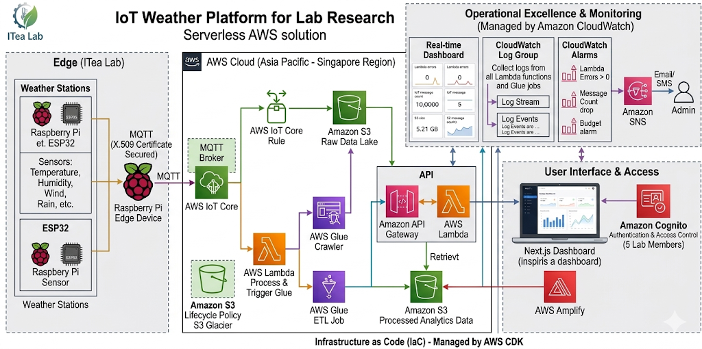

# ĐỀ XUẤT DỰ ÁN: Nền tảng Thời tiết IoT cho Nghiên cứu Phòng Lab

**Giải pháp AWS Serverless cho giám sát thời tiết thời gian thực**

## 1. Tóm tắt điều hành
Dự án nhằm xây dựng nền tảng IoT cho **ITea Lab** (TP.HCM) để tối ưu hóa việc thu thập và phân tích dữ liệu thời tiết. Hệ thống hỗ trợ 5 trạm hiện tại và có khả năng mở rộng lên 15 trạm, sử dụng thiết bị biên (Raspberry Pi/ESP32) kết nối qua MQTT. Bằng cách tận dụng hạ tầng AWS Serverless, nền tảng đảm bảo khả năng giám sát thời gian thực và phân tích dự báo với chi phí vận hành tối ưu.

## 2. Tuyên bố vấn đề
* **Thách thức hiện tại:** Quy trình thu thập dữ liệu thủ công, thiếu tính tập trung, khó quản lý khi số lượng trạm tăng lên và chi phí sử dụng các nền tảng bên thứ ba quá cao.
* **Giải pháp:** Xây dựng hệ thống tập trung sử dụng AWS IoT Core, AWS Glue ETL và Amplify để tự động hóa hoàn toàn luồng dữ liệu từ các trạm đo đến bảng điều khiển phân tích.
* **Hiệu quả (ROI):** Giảm thiểu thao tác thủ công, cải thiện độ tin cậy của dữ liệu và cung cấp nguồn Data Lake ổn định cho nghiên cứu AI. Thời gian hoàn vốn dự kiến từ 6–12 tháng.

## 3. Kiến trúc giải pháp
Hệ thống áp dụng kiến trúc Serverless để đảm bảo khả năng mở rộng và tối ưu chi phí.

* **Các dịch vụ AWS chủ chốt:**
    * **Tiếp nhận dữ liệu:** AWS IoT Core (MQTT).
    * **Tính toán & Xử lý:** AWS Lambda, AWS Glue (ETL Jobs).
    * **Lưu trữ:** Amazon S3 (Data Lake + Analytics Bucket).
    * **Giao diện người dùng:** AWS Amplify (Next.js), Amazon Cognito.
* **Luồng dữ liệu:** Thiết bị biên (Raspberry Pi) → AWS IoT Core → S3 Data Lake → AWS Glue → S3 Analytics → Giao diện Web.

## 4. Triển khai kỹ thuật
* **Các giai đoạn triển khai:**
    1. **Tháng 0 (Lập kế hoạch):** Đánh giá trạm cũ & thiết kế kiến trúc.
    2. **Tháng 1 (Tính khả thi):** Ước tính chi phí bằng AWS Pricing Calculator.
    3. **Tháng 2 (Tối ưu hóa):** Tối ưu hóa kiến trúc (Lambda & Next.js).
    4. **Tháng 3 (Triển khai):** Phát triển (CDK/SDK), kiểm thử và vận hành chính thức.
* **Yêu cầu:** Raspberry Pi chạy Docker (lọc dữ liệu biên), sử dụng AWS CDK để quản lý hạ tầng dưới dạng mã (IaC).

## 5. Ước tính ngân sách
* **Chi phí phần cứng:** ~265 USD (đầu tư một lần).
* **Chi phí vận hành AWS (Ước tính):** ~0,7 USD/tháng (~8,40 USD/năm).
    * *Các hạng mục chính:* MQTT messages, S3 Storage, AWS Glue, API Gateway.

## 6. Đánh giá rủi ro & Chiến lược giảm thiểu
| Rủi ro | Mức độ | Chiến lược giảm thiểu |
| :--- | :--- | :--- |
| Mất kết nối mạng | Trung bình | Lưu trữ cục bộ trên Raspberry Pi (Docker). |
| Hỏng cảm biến | Cao | Kiểm tra định kỳ, dự phòng linh kiện thay thế. |
| Vượt ngân sách | Thấp | Thiết lập Budget Alerts trong AWS Billing Dashboard. |

## 7. Kết quả kỳ vọng
* **Kỹ thuật:** Xây dựng hệ thống tự động hóa thay thế các quy trình thủ công, có khả năng mở rộng lên 15 trạm.
* **Nghiên cứu:** Thiết lập nguồn Data Lake ổn định để huấn luyện các mô hình AI và phục vụ các dự án nghiên cứu nội bộ trong ít nhất 1 năm.